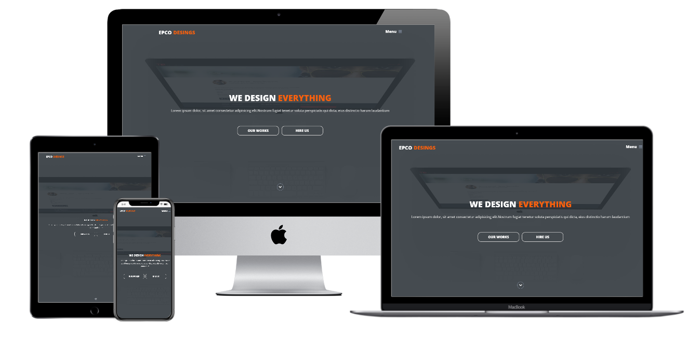

# Epco Designs

 

Epco Designs is a landing page website for apps design company.

You can view the website from [here](https://epcodesigns.netlify.app/)

  

## Demo
 
  

## Versions  

* [v1](https://github.com/Mohamed-Elhawary/epco-designs/tree/v1)  

   - Not Responsive Template.  

* [v1.1](https://github.com/Mohamed-Elhawary/epco-designs/tree/v1.1)  

   - Use Media Query for Responsive.  

## Built With

* HTML5
* CSS3
* JS  

## Libraries  

* [jQuery.js](https://jquery.com/)
* [html5shiv.js](https://github.com/aFarkas/html5shiv)
* [Font Awesome](https://fontawesome.com/)  
* [Normalize.css](https://necolas.github.io/normalize.css/)
  
## Plugins 

* [nicescroll.js](https://nicescroll.areaaperta.com/)  

## Author

* [Mohamed Elhawary](https://www.linkedin.com/in/mohamed-elhawary14/)

## Contact me through my social accounts

* Email: mohamed.k.elhawary@gmail.com
* [LinkedIn](https://www.linkedin.com/in/mohamed-elhawary14/)
* [Github](https://github.com/Mohamed-Elhawary)  
* [Behance](https://www.behance.net/mohamed-elhawary14)
* [Codepen](https://codepen.io/Mohamed-ElHawary) 

## License

Licensed under the [MIT License](LICENSE)

